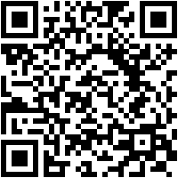
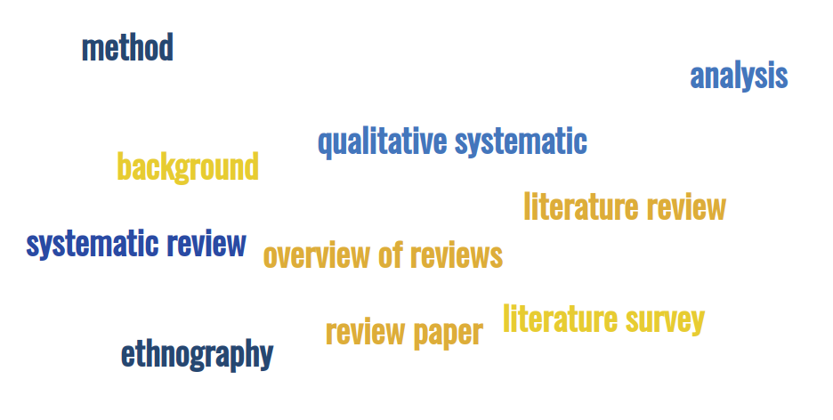
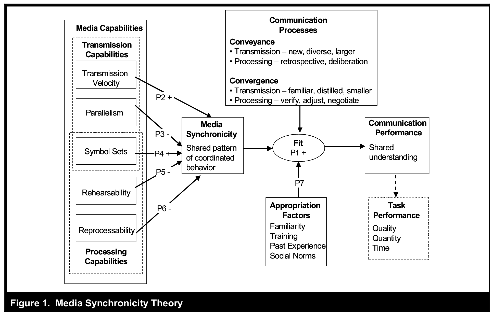
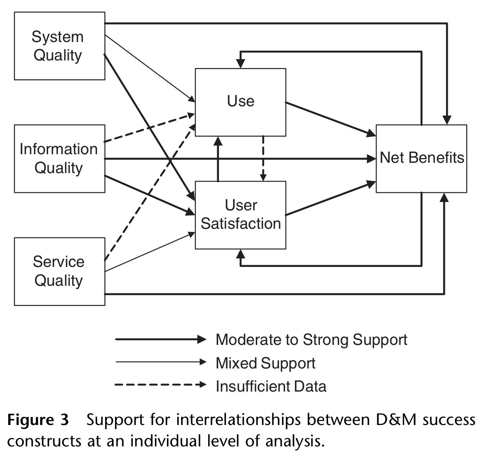

<!-- _class: centered -->

# The Literature Review Seminar

Seminar, Master

Prof. Dr. Gerit Wagner
Fakultät Wirtschaftsinformatik und Angewandte Informatik
Otto-Friedrich-Universität Bamberg

---

# Prior knowledge of literature reviews, topics, and expectations

- What is your topic and research question for this seminar?
- What are your expectations for the seminar?
- Did you work on a literature review before?

---

# Your instructor: Prof. Dr. Gerit Wagner

- Sustained **fascination** for literature reviews for 10+ years
- 2014-2018: **Disseration** on the scientific impact of literature reviews
- 2020-2023: Postdoctoral fellowship at HEC Montréal (Canada):

    - Worked with **Guy Paré**, Ph.D., a frequent co-author and mentor, who serves as a Senior Editor for Literature Reviews at JAIS
    - Served as a TA for the **literature review seminar** for Ph.D. students at five universities in Montréal
 
- I have **published 20 papers related to literature reviews** (out of 30)
- I started developing **CoLRev**, a Python tool for literature reviews

---

TODO : add the hierarychy of evidence (compare to IS where practitioners may often use practitioner journal/opinion papers)

---

# Why literature reviews are exciting (I)

Literature reviews are essential to respond to key trends

- The rapid growing volume and variety of research output, e.g., the EQUATOR network lists over 600 guidelines for different research methods
- Expectations to exercise critical judgment of prior research, e.g., retracts, papers in predatory journals, theories or methods that have shortcomings, papers that are written by tools like genAI
- The need to avoid reinventing the wheel, e.g., cases like the grit construct, which is basically identical with conscientiousness
 
In the future, the ability to synthesize, organize, and critically assess prior research will become even more essential.

---

# Why literature reviews are exciting (II)

Literature reviews can make a variety of original contributions, ranging from 

- conceptual contributions that could never be accomplished in an individual study
- to reviews that aggregate empirical evidence, and address common errors that cannot be eliminated in empirical studies (e.g., measurement error or publication bias)

---

# Example: Media Synchronicity Theory (Dennis et al. 2006)

---

# Example: Review of the IS Success model (Petter et al. 2008)

---

# Why literature reviews are exciting (III)

- Exemplary contributions can have a profound impact (e.g., Vial 2019 is cited 2,000 times per year)
- There are open challenges, such as 

    - Differences and synergies across disciplines,
    - Design of LR software to manage data, AI, and collaboration,
    - Coping with massive input and addressing urgent demands (e.g., [COVID reviews](https://github.com/greenelab/covid19-review))

---

# Learning objectives

Acquire a broad understanding of

- the **goals** and types of literature reviews
- the **steps** of the process
- the **qualities** of a good review paper
- the **tools** available

# Outcome

- A **review protocol** applying this understanding and a short **presentation**
- [Criteria and resources](https://digital-work-lab.github.io/literature-review-seminar/docs/protocol.html) are available online
- Dates for submission and presentation: see [outline](../index.html#seminar-paper)

---

# Administration

Contact: gerit.wagner@uni-bamberg.de

Consultation hours: via [calendly](https://calendly.com/gerit-wagner/30min?month=2023-10)
Web: https://www.uni-bamberg.de/digital-work

Materials: available [online](https://digital-work-lab.github.io/literature-review-seminar/)

---

# Materials

Slides
- Presentation slides will be made available for download.
- You are expected to take complementary notes and read the recommended literature.

Literature
- Literature and complementary materials will be listed at the end of each lecture.
- Materials will be made available via VC whenever possible.
- Reading of complementary materials depends on your interest and ambition.

Acknowledgement:
- Guy Paré: the materials are largely based on his literature review seminar.

---

# We value your feedback and suggestions

We encourage you to share your feedback and suggestions on this slide deck:

<a href="https://github.com/digital-work-lab/literature-review-seminar/edit/main/00-orga.md" target="_blank">
   Suggest specific changes by directly modifying the content
</a>
 
<a href="https://github.com/digital-work-lab/literature-review-seminar/issues/new" target="_blank">
   Provide feedback by submitting an issue
</a>
 

Your feedback plays a crucial role in helping us align with our core goals of **impact in research, teaching, and practice**. By contributing your suggestions, you help us further our commitment to **rigor**, **openness** and **participation**. Together, we can continuously enhance our work by contributing to **continuous learning** and collaboration across our community.

Visit this <a href="https://digital-work-lab.github.io/handbook/docs/10-lab/10_processes/10.01.goals.html" target="_blank">page</a> to learn more about our goals:  🚀 🛠️ ♻️ 🙏 🧑‍🎓️ . 

---

# References

Dennis, A. R., Fuller, R. M., & Valacich, J. S. (2008). Media, tasks, and communication processes: A theory of media synchronicity. *MIS Quarterly*, 32(3), 575-600. doi:[10.2307/25148857](https://www.jstor.org/stable/25148857)

Petter, S., DeLone, W., & McLean, E. (2008). Measuring information systems success: models, dimensions, measures, and interrelationships. *European Journal of Information Systems*, 17(3), 236-263. doi:[10.1057/ejis.2008.15](https://link.springer.com/article/10.1057/ejis.2008.15)

Rando, H. M., Greene, C. S., Robson, M. P., Boca, S. M., Wellhausen, N., Lordan, R., ... & COVID-19 Review Consortium. (2021). SARS-CoV-2 and COVID-19: An evolving review of diagnostics and therapeutics. Manubot. [link](https://greenelab.github.io/covid19-review/v/32afa309f69f0466a91acec5d0df3151fe4d61b5/)

Vial, G. (2019). Understanding digital transformation: A review and a research agenda. *The Journal of Strategic Information Systems*, 28(2), 118-144. doi:[10.1016/j.jsis.2019.01.003](https://www.sciencedirect.com/science/article/pii/S0963868717302196)
