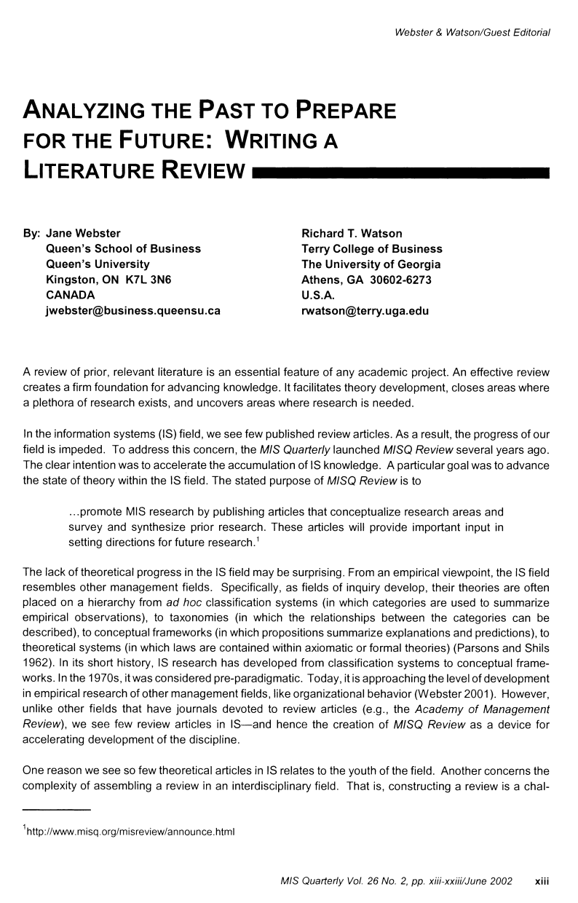
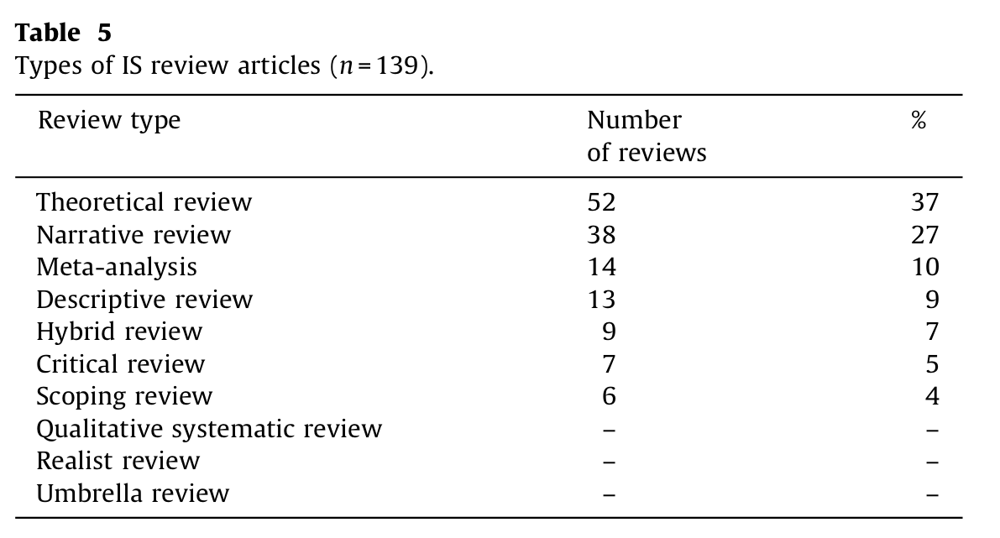
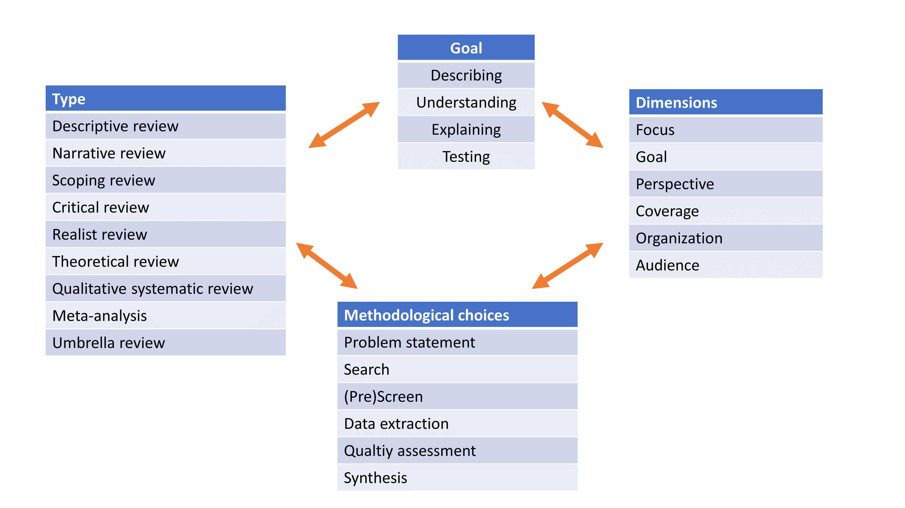
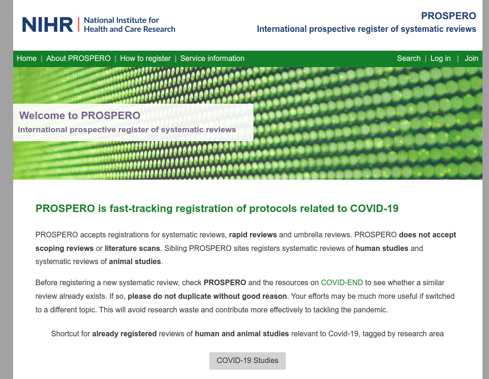

# The Literature Review Seminar

## Goals and types of reviews

- Familiarize with different forms of reviews
- Dissociate goals and review types, along with their dimensions
- Appreciate the key elements of a review protocol

---

## Forms of literature reviews

Generally, literature reviews can take different forms, including

- a **standalone review paper**
- a **background section** of a primary study (e.g., related work, theoretical background, conceptual foundations)
- a mandatory **part of a funding proposal**
- a part of a **Ph.D. thesis**
- a **review protocol** (e.g., published in a conference or a registry)

Our focus is on **standalone reviews**: an "independent paper whose purpose is to synthesize the extant literature in a field without collection of empirical data" (Templier and Paré 2018).

---

## Literature reviews in information systems

- Early editorial by Webster and Watson (2002, MISQ, > 12.000 citations) with key suggestions

    - Rigorous search, including forward and backward searches
    - Concept matrix
    - Concept-centric writing instead of author-centric summaries

- Establishment of the Theory and Review Department at MISQ, and similar initiatives at JAIS, and JSIS
- Active discourse covering typological pluralism, systematicity, and transparency across top journals in Information Systems

---

## Goals of literature reviews

Building on Gregor (2006), Rowe (2014) distinguishes four goals of literature reviews:

- **Describing**: summarizing or classifying prior research on a phenomenon with little or no contribution to theory, i.e., without discussing underlying assumptions or rationales
- **Understanding**: making sense of prior literature and new phenomena, working towards a conceptual understanding, and often involving an in-depth, broad, or critical discussion before drawing synthetic conclusions
- **Explaining**: drawing on the literature to develop a conceptual framework, or theory with testable hypotheses, i.e., statements that explain real-world phenomena, and can be tested empirically
- **Theory testing**: extracting data from empirical studies to assess the aggregated evidence that has accumulated

---

## The typology of Paré et al. (2015)

- Paré et al. (2015) published the established typology of literature reviews, covering 9 distinct types of reviews (plus hybrid reviews)
- The review types can be aligned with the goals of Rowe (2014), as indicated in the table (Templier and Paré 2018)

**Task**: Familiarize yourself with the types of reviews in the typology.

---

## Application

Classify the selection of review papers according to the typology of Paré et al. (2015):

- Shim et al. (2022)
- Seuring (2013)
- Powell et al. (2004)
- Bélanger and Crossler (2011)
- King and He (2006)
- Petter et al. (2008)
- Kitsiou et al. (2017)
- Melville et al. (2004)
- Otte-Trojel et al. (2016)

---

## Dimensions (Cooper's taxonomy)

---

## Central aspect: Internal coherence

---

<!-- _class: centered -->

# Break

<!-- https://unsplash.com/de/fotos/%EC%BB%B5%EC%97%90-%EC%BB%A4%ED%94%BC%EC%9D%98-%EC%8B%9C%EA%B0%84-%EA%B2%BD%EA%B3%BC-%EC%82%AC%EC%A7%84-5iRgh_G0eRY -->

---

## The RightReview tool

The [RightReview](https://rightreview.knowledgetranslation.net/) tool provides a survey of literature review dimensions to identify the right review type for your project.

- Complete the survey and check your results.
- Do you agree? Are there any dimensions that are unclear?

---

## What can we publish from a review project?

- Review protocol: [Open Science Foundation (OSF)](https://osf.io/), [PROSPERO](https://www.crd.york.ac.uk/prospero/), conference proceedings
- Search strategy: [searchRxiv](https://www.cabidigitallibrary.org/journal/searchrxiv)
- Options to publish standalone review papers:

    - Conference proceedings (e.g., ICIS track for literature reviews)
    - Specialized journals for literature reviews (e.g., International Journal of Management Reviews, Foundations and Trends® in [Information Systems, Entrepreneurship, Management, Marketing,...])
    - Journals with theory and review departments (e.g., Journal of the AIS)
    - Review special issues (e.g., Journal of Strategic Information Systems)
    - Regular submission to journals

- Review dataset: [OSF](https://osf.io/), [SYNERGY datasets](https://github.com/asreview/synergy-dataset)

---

## Review protocols: Their purposes

- Make concrete plans for a review project
- Pilot-test the feasibility and potential contribution
- Solicit feedback from peers
- Publish the protocol to signal your work (e.g., in a registry like PROSPERO or at OSF)

--- 

## Review protocols: Conceptions

- A plan that is developed a priori and fixed. The protocol regulates researchers and requires them to follow an inflexible set of rules. Fixed protocols are more common in the health sciences and often associated with theory-testing reviews like meta-analyses.
- A “living plan”. The protocol is a living document which is used as a work log that records how the review project has evolved over time. Researchers may deviate from their original plan. Protocol development is thus iterative.

---

## Review protocols: Structure and contents (I)

- Title (indicating that this is a review protocol)
- Plain or structured abstract (written at the end) and keywords (up to 5)
- Introduction section (WHAT and WHY)

    - Generativity statements
    - Brief introduction of the topic, phenomenon, theory of interest
    - Rationale for the review
    - Review objectives (and research questions)
    - Scope of the review
    - Expected contributions of the review

<!-- - PareWagnerPrester2023: table 1 -->

---

## Review protocols: Structure and contents (II)

- Background section (WHAT / if applicable)

    - Definition of key concepts / presentation of the framework to be used to organize the review, presentation of the theory at the center of the review, etc.

- Methods

    - Type of review and justification
    - Search strategy and procedures
    - Screening strategy and procedures
    - Quality appraisal strategy and procedures
    - Data extraction strategy and procedures
    - Data analysis/synthesis strategy and procedures

---

## Review protocols: Structure and contents (III)

- Conclusion

    - Methodological limitations
    - Potential implications for research, practice, and/or policymaking

- Appendices (WHO, HOW, WHEN)

    - List of contributors and their responsibilities
    - Detailed timetable
    - List of software tools used for what purposes
    - Intended publication plan (protocol publication/registration, strategy for reporting and publishing the full review article)
    - Other declarations (funding sources, etc.)

---

## Practice: First draft of a review protocol

- Create a quick draft for your protocol, covering the following elements:

    - Title and keywords
    - Introduction in bullet points 
    - Background (what contents you would cover)

- Discussion of your proposals

---

# We value your feedback and suggestions

We encourage you to share your feedback and suggestions on this slide deck:

<a href="https://github.com/digital-work-lab/literature-review-seminar/edit/main/slides/01-goals.md" target="_blank">
   Suggest specific changes by directly modifying the content
</a>
 
<a href="https://github.com/digital-work-lab/literature-review-seminar/issues/new" target="_blank">
   Provide feedback by submitting an issue
</a>
 

Your feedback plays a crucial role in helping us align with our core goals of **impact in research, teaching, and practice**. By contributing your suggestions, you help us further our commitment to **rigor**, **openness** and **participation**. Together, we can continuously enhance our work by contributing to **continuous learning** and collaboration across our community.

Visit this <a href="https://digital-work-lab.github.io/handbook/docs/10-lab/10_processes/10.01.goals.html" target="_blank">page</a> to learn more about our goals:  🚀 🛠️ ♻️ 🙏 🧑‍🎓️ . 

---

## References

**Goals and review types**

Rowe, F. (2014). What literature review is not: diversity, boundaries and recommendations. *European Journal of Information Systems*, 23(3), 241-255. doi:[10.1057/ejis.2014.7](https://link.springer.com/article/10.1057/ejis.2014.7)

Paré, G., Trudel, M. C., Jaana, M., & Kitsiou, S. (2015). Synthesizing information systems knowledge: A typology of literature reviews. *Information & Management*, 52(2), 183-199. doi:[10.1016/j.im.2014.08.008](https://www.sciencedirect.com/science/article/pii/S0378720614001116)

Templier, M., & Pare, G. (2018). Transparency in literature reviews: an assessment of reporting practices across review types and genres in top IS journals. *European Journal of Information Systems*, 27(5), 503-550. doi:[10.1080/0960085X.2017.1398880](https://www.tandfonline.com/doi/full/10.1080/0960085X.2017.1398880)

---

**Sample classified according to review types**

Bélanger, F., & Crossler, R. E. (2011). Privacy in the digital age: a review of information privacy research in information systems. *MIS Quarterly*, 35(4) 1017-1041. doi:[10.2307/41409971](https://www.jstor.org/stable/41409971)

King, W. R., & He, J. (2006). A meta-analysis of the technology acceptance model. *Information & Management*, 43(6), 740-755. doi:[10.1016/j.im.2006.05.003](https://www.sciencedirect.com/science/article/pii/S0378720606000528)

Kitsiou, S., Paré, G., Jaana, M., & Gerber, B. (2017). Effectiveness of mHealth interventions for patients with diabetes: an overview of systematic reviews. *PloS one*, 12(3), e0173160. doi:[10.1371/journal.pone.0173160](https://journals.plos.org/plosone/article?id=10.1371/journal.pone.0173160)

Melville, N., Kraemer, K., & Gurbaxani, V. (2004). Information technology and organizational performance: An integrative model of IT business value. *MIS Quarterly*, 28(2), 283-322. doi:[10.2307/25148636](https://www.jstor.org/stable/25148636)

---

Otte-Trojel, T., de Bont, A., Rundall, T. G., & van de Klundert, J. (2014). How outcomes are achieved through patient portals: a realist review. *Journal of the American Medical Informatics Association*, 21(4), 751-757. doi:[10.1136/amiajnl-2013-002501](https://academic.oup.com/jamia/article/21/4/751/764620?login=true)

Petter, S., DeLone, W., & McLean, E. (2008). Measuring information systems success: models, dimensions, measures, and interrelationships. *European Journal of Information Systems*, 17, 236-263. doi:[10.1057/ejis.2008.15](https://link.springer.com/article/10.1057/ejis.2008.15)

Powell, A., Piccoli, G., & Ives, B. (2004). Virtual teams: a review of current literature and directions for future research. *ACM SIGMIS Database: the DATABASE for Advances in Information Systems*, 35(1), 6-36. doi:[10.1145/968464.968467](https://dl.acm.org/doi/abs/10.1145/968464.968467)

Seuring, S. (2013). A review of modeling approaches for sustainable supply chain management. *Decision Support Systems*, 54(4), 1513-1520. doi:[10.1016/j.dss.2012.05.053](https://www.sciencedirect.com/science/article/pii/S0167923612001741)

---

Shim, J. P., Warkentin, M., Courtney, J. F., Power, D. J., Sharda, R., & Carlsson, C. (2002). Past, present, and future of decision support technology. *Decision Support Systems, 33(2), 111-126. doi:[10.1016/S0167-9236(01)00139-7](https://www.sciencedirect.com/science/article/pii/S0167923601001397)

**Dimensions**

Cooper, H. M. (1988). Organizing knowledge syntheses: A taxonomy of literature reviews. *Knowledge in Society*, 1(1), 104. doi:[10.1007/BF03177550](https://link.springer.com/article/10.1007/BF03177550)

**Protocols**

Paré, G., Wagner, G., & Prester, J. (2023). How to develop and frame impactful review articles: key recommendations. *Journal of Decision Systems*, 1-17. doi:[10.1080/12460125.2023.2197701](https://www.tandfonline.com/doi/full/10.1080/12460125.2023.2197701)