# The Literature Review Seminar

## Steps of the process

- Understand the generic steps of the review process
- Appreciate the critical methodological choices in the search, screen, and analysis

---

## What are the generic steps of a literature review?

<!-- 
https://unsplash.com/de/fotos/menschen-die-tagsuber-auf-grunem-rasen-sitzen-7rImz-goqfQ
-->
---

## Generic steps: Examples

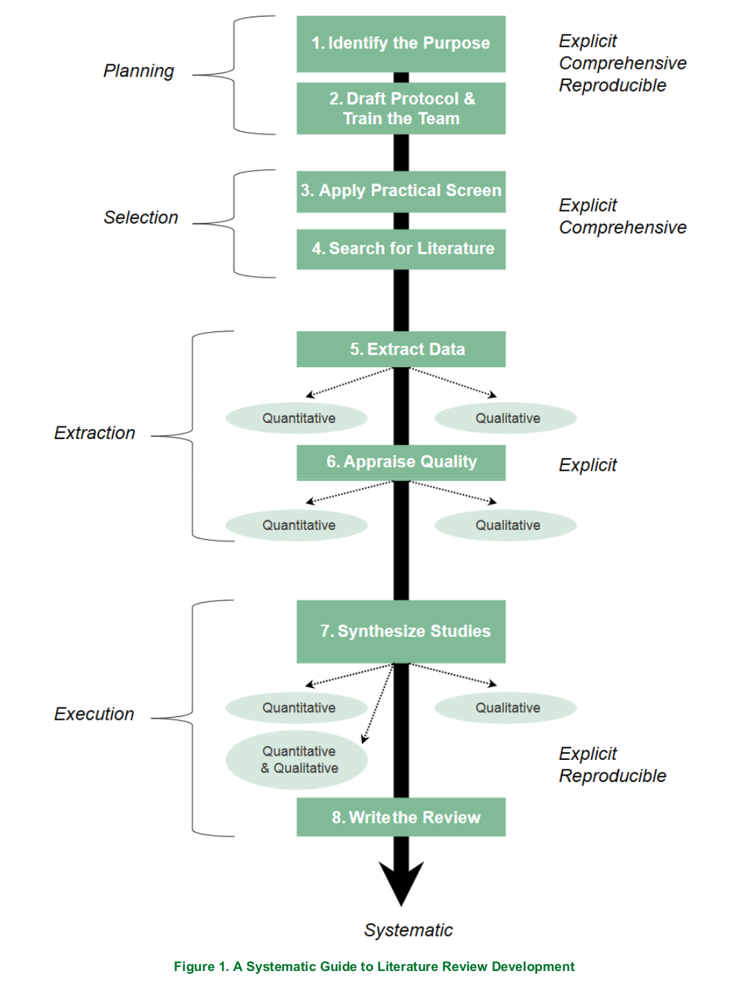

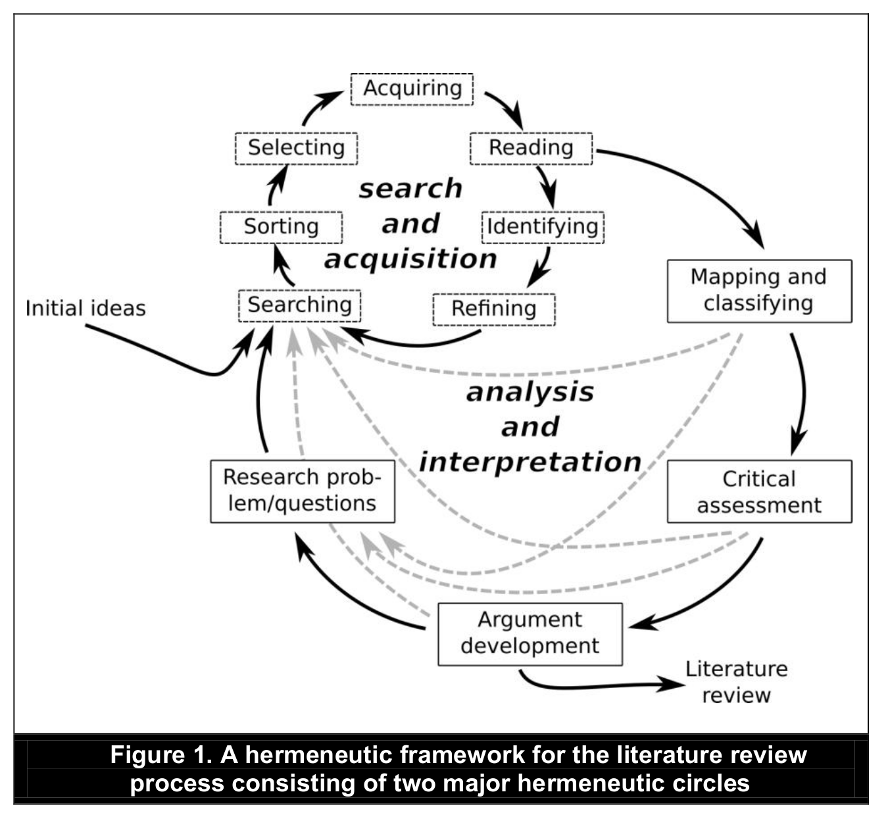

- The hermeneutic framework of Boell and Cecez-Kecmanovic (2014) vs.
- The systematic guide of Okoli (2015)

---

## Generic steps: Templier and Paré (2018)

---

## Generic steps: Templier and Paré (2018)

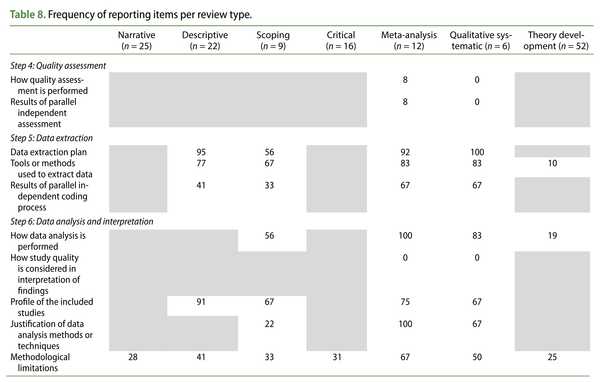

---

## Generic steps

Summary

- The **nature of steps varies**, including their labels, their characteristics, and how they are arranged
- The steps **depend on the review type**
- Some steps are more **generic**, while others are more **specific** and only apply to selected types of reviews

In the following, we focus on the steps summarized by Templier and Paré (2018):

1. Problem formulation
2. Literature search
3. Screening for inclusion
4. Quality assessment
5. Data extraction
6. Data analysis and interpretation

---

## Problem formulation

- Rationale for the review, including an overview of related review papers
- Gap-spotting or problematization (Alvesson and Sandberg 2011):

    - Gap-spotting is seen as (too) common, and may only signify a contribution if the authors can make a convincing argument that the gap is important
    - Problematization, as an approach that challenges existing theory and the underlying assumptions, can lead to more interesting and noteworthy contributions

- Research question or objectives

---

## Literature search: Foundations

- Search types: *Lookup* vs. *exploratory* vs. **systematic search** (Gusenbauer and Haddaway 2021)
- Search scope: time, journals, and academic vs. gray literature
- Search techniques (with associated search sources):

    - Database search (keyword-based)
    - Backward search, i.e., search reference sections to go back in time (aka. snowballing, pearl-growing)
    - Forward search, i.e., using citation indices to go forward in time
    - Table-of-content search (whole journals)
    - Sampling from prior review papers
    - Consulting with peers (e.g., through direct contact or mailing lists)

---

## Literature search: Citation searches

---

## Literature search: The database search

- Most common search strategy in the management disciplines (58% according to Hiebl, 2023)
- Common databases: Web of Science, EBSCO Host, ABI Informs, AIS eLibrary, ACM Digital Library, IEEEXplore, etc. (Knackstedt and Winkelmann 2006, Hiebl 2023)
- Effective search strategies for database searches combine search terms with Boolean operators

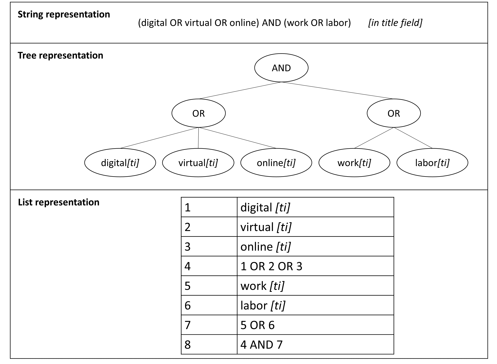

---

## Literature search: The "building-blocks" approach

- RQ: What factors do influence physicians’ acceptance of telemedicine?

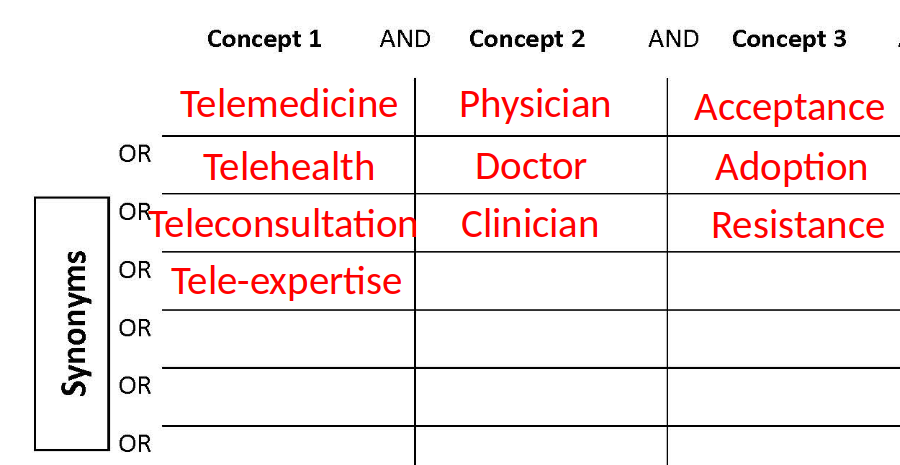

Resulting search string: `(telemedicine OR telehealth OR ...) AND (physician OR doctor OR ...) AND (adoption OR acceptance OR resistance OR ...)`

Building blocks can be based on established frameworks like PICO (population-intervention-control-outcome)

---

## Exercise: Review a search strategy

Imagine you serve as a reviewer for a conference. You review a paper on algorithmic decision-making, along with Table 2.

- Evaluate the proposed search strategy critically, taking into account the building-block approach. 
- Make a recommendation to accept, revise, or reject.

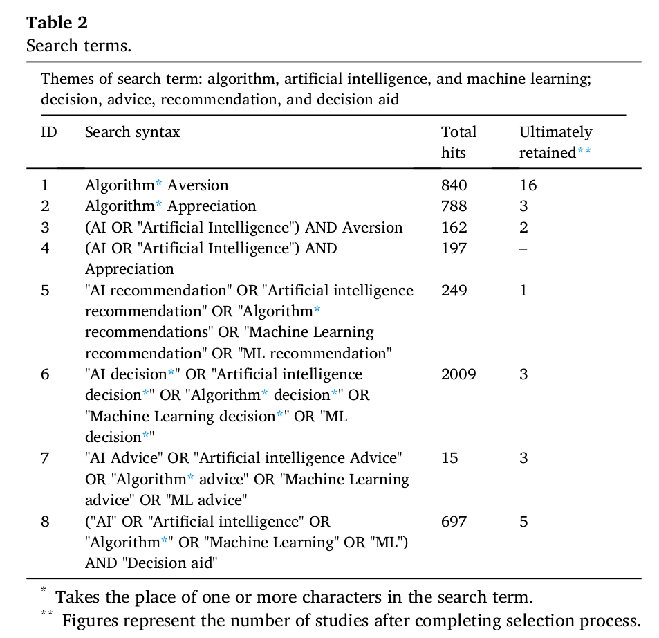

> \* Note: Example taken from Mahmud, H., Islam, A. N., Ahmed, S. I., & Smolander, K. (2022). What influences algorithmic decision-making? A systematic literature review on algorithm aversion. *Technological Forecasting and Social Change*, 175, 121390.

---

## Literature search: Strengths and shortcomings of database searches

Strengths:

- Relatively efficient (see Wagner et al. 2021, Appendix A3)
- Transparent and reproducible

Shortcomings:

- Keyword searches: rely on exact matches 
- Need to be familiar with the vocabulary (check keywords or taxonomies like [MeSH](https://meshb.nlm.nih.gov/?_gl=1*1v2wumx*_ga*MTAzMDkzMDY3OC4xNjg1OTY3ODEy*_ga_7147EPK006*MTY5ODMwNDkxNi4xMC4xLjE2OTgzMDQ5MjIuMC4wLjA.*_ga_P1FPTH9PL4*MTY5ODMwNDkxNi4xMC4xLjE2OTgzMDQ5MjIuMC4wLjA.) etc.)
- Assumption of controlled scientific vocabulary although disciplines like Information Systems have abandoned corresponding efforts decades ago (Weber 2003)

---

## Literature search: Search metrics

The common objective is to identify all relevant papers. Literature searches retrieve documents:

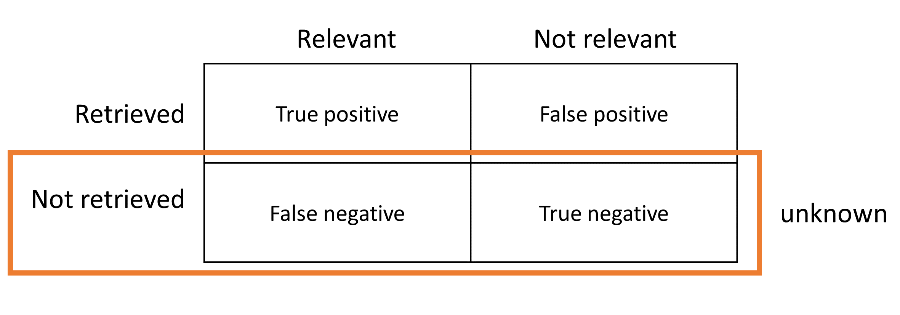

Three key metrics are particularly relevant in the context of literature searches (Cooper et al. 2018):

1. **Sensitivity** aka. recall: $TP / (TP + FN)$. *How many of the relevant papers do we find?* ❓
2. **Specificity**: $TN / (TN + FP)$. *How well does the search exclude irrelevant results?* ❓
3. **Precision**: $TP / (TP + FP)$. *How many of the search results are actually relevant?*

---

## Literature search: Assessing searches

- **Precision** is the only metric that can be measured in a typical literature review
- A **highly precise search strategy should be suspicious** because the search may not be comprehensive enough
- Based on the [SYNERGY](https://github.com/asreview/synergy-dataset) dataset, average precision is 2% - 4% in medicine, chemistry, and computer science

Would you expect more precise searches in disciplines like Information Systems, Management, or the Social Sciences? 

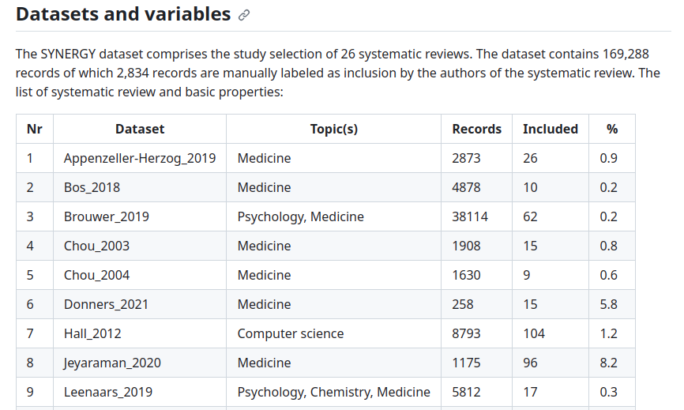

---

## Literature search: Application

- Draft a search strategy for your topic, following the building-blocks approach.

- Does the building block approach provide a good fit with your context?

---

## Literature search: Outlook

Open challenge: 

- How can we iterate efficiently?
- How do we justify the decision to terminate a search?
- How can we use evidence to search effectively?
- How can we make progress without database providers?

<!-- 
https://unsplash.com/de/fotos/toddlers-standing-in-front-of-beige-concrete-stair-bJhT_8nbUA0
-->

---

## Screen

- The screen is typically completed in two parts:

    - A pre-screen based on metadata (*"include if in doubt"*)
    - A screen based on full-text documents, resulting in the final sample

- The screen is often based on explicit inclusion and exclusion criteria

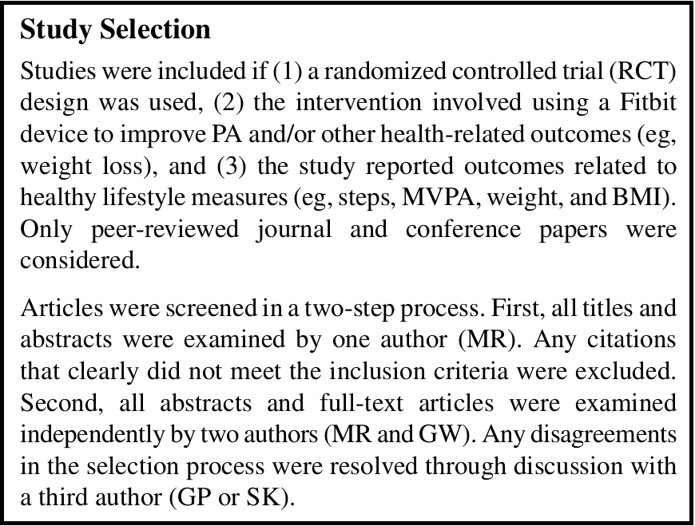

---

## Screening reliability

Screening tasks are often split among the review team to complete the process **more quickly**, and to ensure **reliable decisions**.

Process:

1. Definition of criteria, training, and pilot test
2. Parallel-independent screen (partially or fully overlapping sample)
3. Independent screen of the remaining papers (if any)
4. Reconciliation: in case of disagreements, final decisions are made by selected team members (often more senior researchers)
5. Calculate inter-rater agreement (e.g., Cohen's Kappa) and report the process

<!-- 
https://en.wikipedia.org/wiki/Cohen%27s_kappa
-->
---

## Interpretation of Kappa Values

 

| Kappa Value Range | Interpretation           |
|-------------------|--------------------------|
| ≤ 0               | No agreement             |
| 0.01 – 0.20       | None to slight           |
| 0.21 – 0.40       | Fair                     |
| 0.41 – 0.60       | Moderate                 |
| 0.61 – 0.80       | Substantial              |
| 0.81 – 1.00       | Almost perfect agreement |

> Note: When data is skewed—meaning one category is much more common than others—the Kappa statistic can be artificially low even if there is a high level of agreement. This occurs because Kappa adjusts for the level of agreement that would be expected purely by chance. In skewed distributions, the expected chance agreement tends to be high, which lowers the Kappa score. Essentially, in skewed distributions, even a relatively high observed agreement may not lead to a high Kappa, as the metric accounts for the imbalance.

---

## Reporting the search and screen

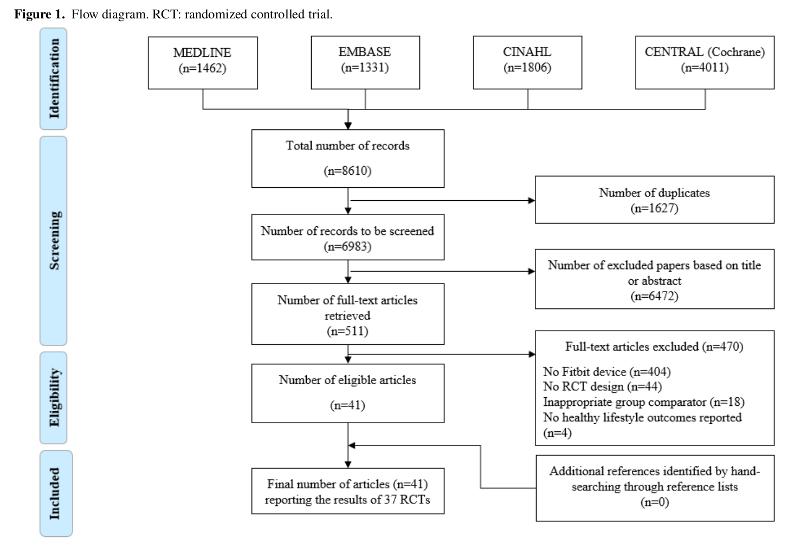

The PRISMA flow chart (updated version by Tricco et al. 2018)

An online version is available [here](https://estech.shinyapps.io/prisma_flowdiagram/)

---

<!-- _class: centered -->

# Break

<!-- https://unsplash.com/de/fotos/%EC%BB%B5%EC%97%90-%EC%BB%A4%ED%94%BC%EC%9D%98-%EC%8B%9C%EA%B0%84-%EA%B2%BD%EA%B3%BC-%EC%82%AC%EC%A7%84-5iRgh_G0eRY -->

---

## Reading strategies

The reading activities can be organized strategically at two levels:

- The overall corpus level: In which order should papers be read or skimmed?

- The individual paper level: How should the different parts of a paper be read?

Assume you have 300 papers to cover, how would you organize the reading activities?

---

## Data analysis

Key differences with regard to data extraction and analysis:

- Focus on metadata vs content 
- Inductive vs deductive reasoning

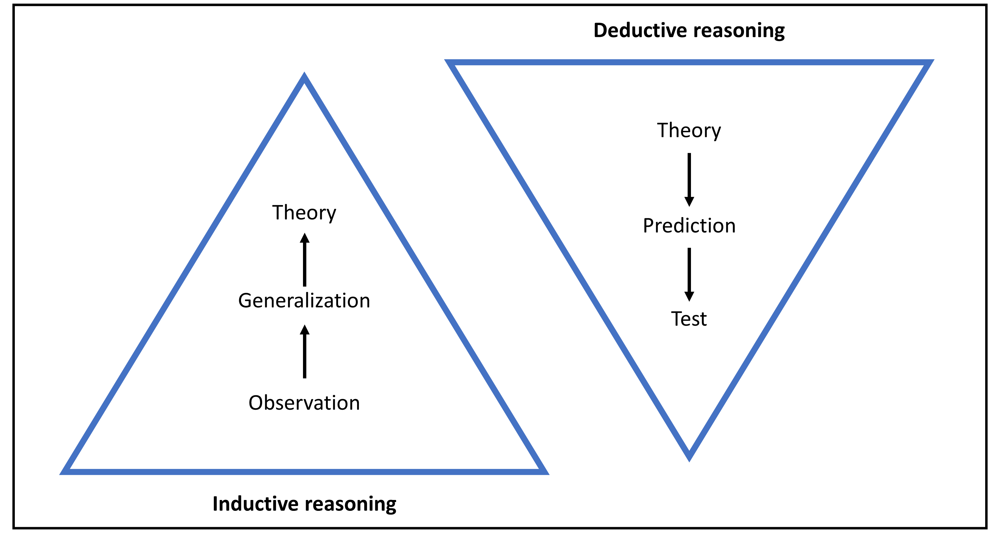

---

## Data analysis example: Metadata profiling (example)

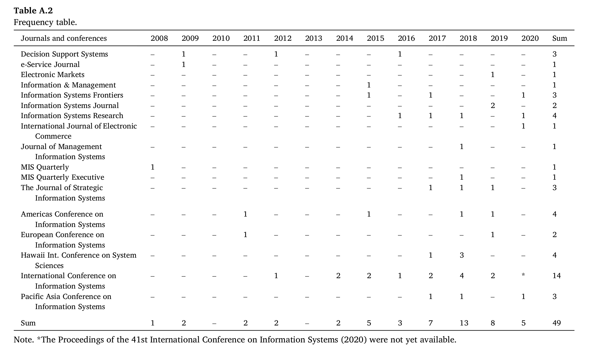

---

## Data analysis example: Co-citation analysis

---

## Data analysis example: VOS viewer

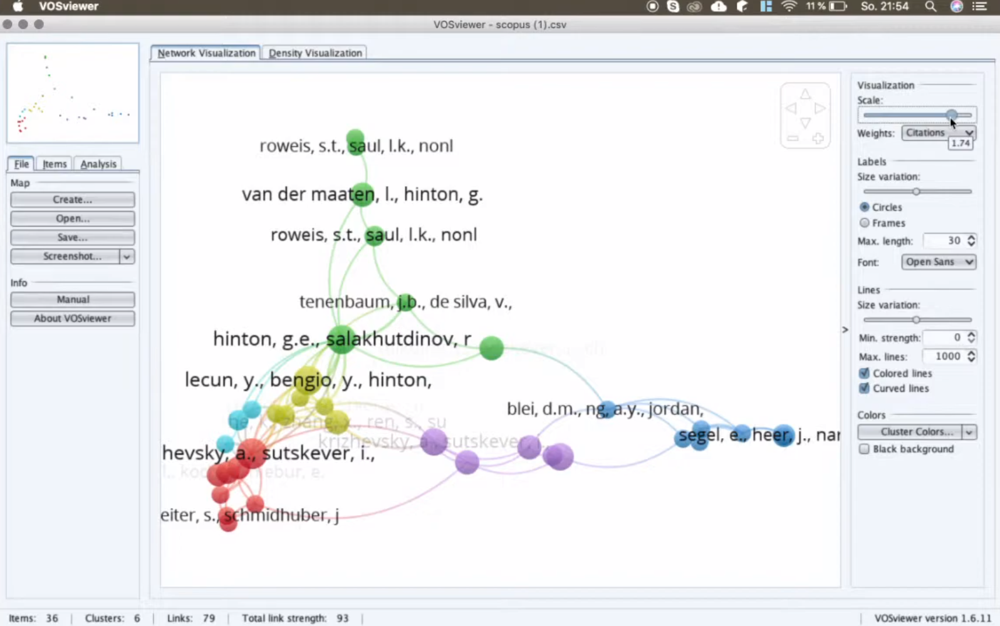

- Example keyword analysis: https://www.youtube.com/watch?v=9dTWkNRxUtw
- Example bibliometric analysis: https://www.youtube.com/watch?v=xmLWjcsV4zQ

---

## Data analysis example: Inductive coding

Grounded theory is an inductive method commonly used in literature reviews (Wolfswinkel et al. 2013)

In the data analysis phase, the three coding techniques are central:

- **Open coding** generates higher-abstraction level type categories from sets of concepts/variables
- **Axial coding** develops categories and relates them to their possible sub-categories
- **Selective coding** integrates and refines the categories

---

## Data analysis: The Gioia data structure

The coding process and results are often illustrated in the *Gioia data structure*

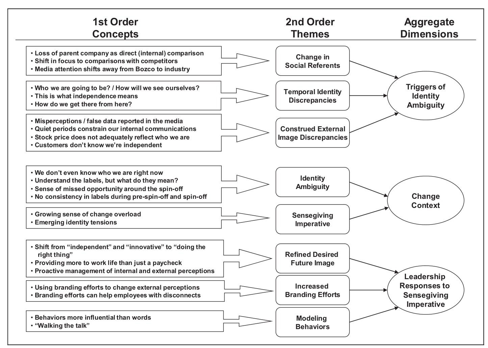

---

## Data analysis: Example for inductive analysis

- Scope: Digital platforms for knowledge-intensive services, such as Upwork, Fiverr, or TopCoder
- Sample: 50 papers, mostly published in the Information Systems discipline
- Data: Text fragments and figures have been pre-selected: [access the worksheet](../teaching_notes/day_1_steps_data_Inductive-coding-Worksheet.pdf)

- Objective: Analyze extant research and inductively develop a process model

<!-- TODO : present a clear Gioia structure as a result -->

---

## Data analysis example: Aggregating evidence (I)

**Vote counting** is one technique to aggregate the evidence from prior empirical studies

- Key variables are extracted and compiled in a list of master codes
- Effects between independent and dependent variables are coded:

    - *+1* for a positive significant effect
    - *0* for no-significant effects
    - *-1* for negative significant effects

---

## Example: Lacity et al. (2011)

Effects are aggregated and presented as follows:

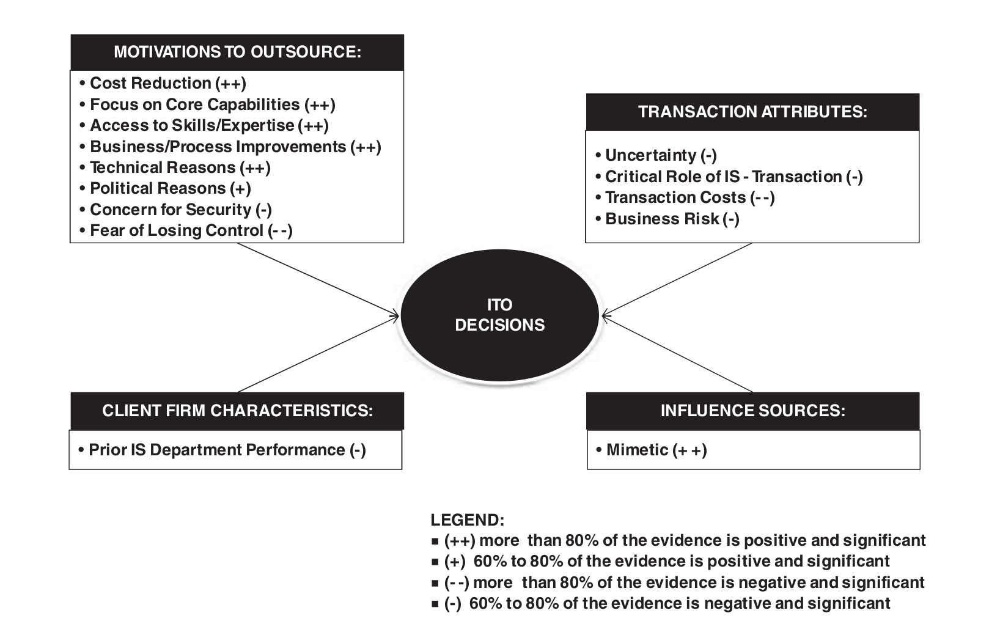

---

## Data analysis example: Aggregating evidence (II)

Strength of vote counting:

- Aggregates evidence from **quantitative and qualitative studies**

Shortcoming of vote counting:

- Risk of bias is not assessed
- Effect sizes are not determined

Meta-analysis techniques address these shortcomings.

---

## Data analysis: Risk of bias assessment (I)

- Example: Ringeval et al. (2020): "Fitbit-Based Interventions for Healthy Lifestyle Outcomes: Systematic Review and Meta-Analysis"
- The [Cochrane risk-of-bias tool for randomized trials (RoB 2)](https://training.cochrane.org/handbook/current/chapter-08) covers seven **domains of bias**, as illustrated in the table

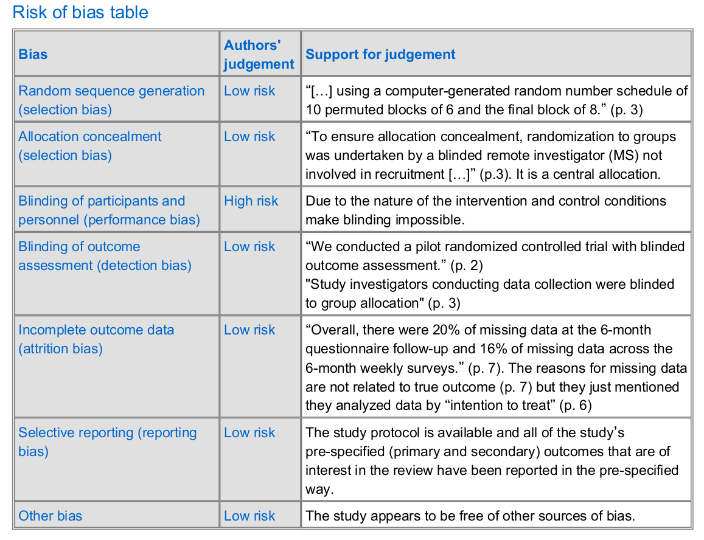

---

## Data analysis: Risk of bias assessment (II)

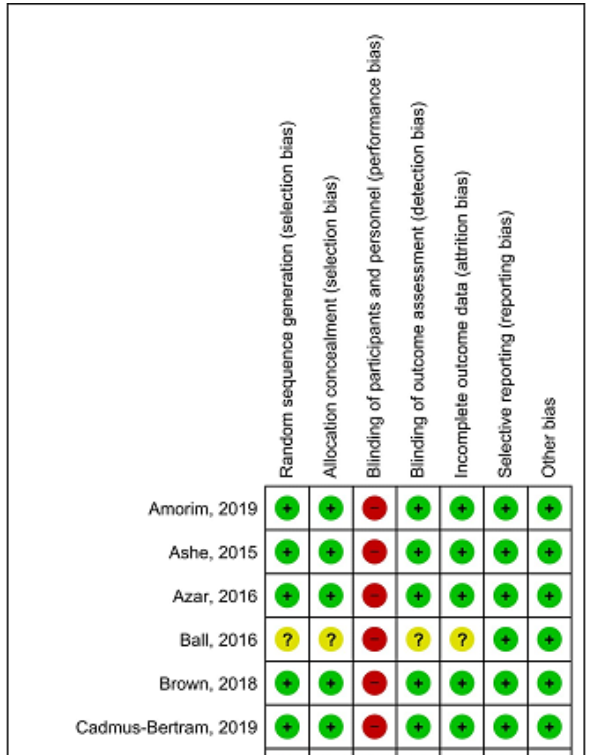

---

## Data analysis: Data extraction

Research objective: "to assess the effects of Fitbit-based interventions, compared with non-wearable control groups, on healthy lifestyle outcomes." (Ringeval et al. 2020)

Data extraction (example): 

- Two randomized controlled trials: Thorndike et al. 2014, van Blarigan et al. 2019
- Extract the following findings (at follow-up):

---

## Data analysis: Forest plot of standardized mean differences

---

## Discussion of the data analysis section

Create a quick draft for the data extraction and analysis section. 

- Would you follow an inductive or deductive approach (why)?
- What outcomes would you expect ideally?

---

# We value your feedback and suggestions

We encourage you to share your feedback and suggestions on this slide deck:

<a href="https://github.com/digital-work-lab/literature-review-seminar/edit/main/slides/02-steps.md" target="_blank">
   Suggest specific changes by directly modifying the content
</a>
 
<a href="https://github.com/digital-work-lab/literature-review-seminar/issues/new" target="_blank">
   Provide feedback by submitting an issue
</a>
 

Your feedback plays a crucial role in helping us align with our core goals of **impact in research, teaching, and practice**. By contributing your suggestions, you help us further our commitment to **rigor**, **openness** and **participation**. Together, we can continuously enhance our work by contributing to **continuous learning** and collaboration across our community.

Visit this <a href="https://digital-work-lab.github.io/handbook/docs/10-lab/10_processes/10.01.goals.html" target="_blank">page</a> to learn more about our goals:  🚀 🛠️ ♻️ 🙏 🧑‍🎓️ . 

---

## References

**Generic steps**

Okoli, C. (2015). A guide to conducting a standalone systematic literature review. *Communications of the Association for Information Systems*, 37. doi:[10.17705/1CAIS.03743](https://aisel.aisnet.org/cais/vol37/iss1/43/)

Boell, S. K., & Cecez-Kecmanovic, D. (2014). A hermeneutic approach for conducting literature reviews and literature searches. *Communications of the Association for information Systems*, 34, 12. doi:[10.17705/1CAIS.03412](https://aisel.aisnet.org/cais/vol34/iss1/12/)

Templier, M., & Pare, G. (2018). Transparency in literature reviews: an assessment of reporting practices across review types and genres in top IS journals. *European Journal of Information Systems*, 27(5), 503-550. doi:[10.1080/0960085X.2017.1398880](https://www.tandfonline.com/doi/full/10.1080/0960085X.2017.1398880)

---

**Problem formulation**

Alvesson, M., & Sandberg, J. (2011). Generating research questions through problematization. *Academy of Management Review*, 36(2), 247-271. doi:[10.5465/amr.2009.0188](https://journals.aom.org/doi/abs/10.5465/amr.2009.0188)

**Search**

Gusenbauer, M., & Haddaway, N. R. (2021). What every researcher should know about searching–clarified concepts, search advice, and an agenda to improve finding in academia. *Research Synthesis Methods*, 12(2), 136-147. doi:[10.1002/jrsm.1457](https://onlinelibrary.wiley.com/doi/full/10.1002/jrsm.1457)

Hiebl, M. R. (2023). Sample selection in systematic literature reviews of management research. *Organizational Research MNethods*, 26(2), 229-261. doi:[10.1177/109442812098685](https://journals.sagepub.com/doi/full/10.1177/1094428120986851)

Knackstedt, R., & Winkelmann, A. (2006). Online-Literaturdatenbanken im Bereich der Wirtschaftsinformatik: Bereitstellung wissenschaftlicher Literatur und Analyse von Interaktionen der Wissensteilung. *Wirtschaftsinformatik*, 1(48), 47-59. doi:[10.1007/s11576-006-0006-1](https://link.springer.com/article/10.1007/s11576-006-0006-1)

---

Wagner, G., Prester, J., & Paré, G. (2021). Exploring the boundaries and processes of digital platforms for knowledge work: A review of information systems research. *The Journal of Strategic Information Systems*, 30(4), 101694. doi:[10.1016/j.jsis.2021.101694](https://www.sciencedirect.com/science/article/pii/S096386872100041X)

**Screen**

Tricco, A. C., Lillie, E., Zarin, W., O'Brien, K. K., Colquhoun, H., Levac, D., ... & Straus, S. E. (2018). PRISMA extension for scoping reviews (PRISMA-ScR): checklist and explanation. 
*Annals of Internal Medicine*, 169(7), 467-473. doi:[10.7326/M18-0850](https://www.acpjournals.org/doi/full/10.7326/M18-0850)

---

**Data analysis**

Wolfswinkel, J. F., Furtmueller, E., & Wilderom, C. P. (2013). Using grounded theory as a method for rigorously reviewing literature. European journal of information systems, 22(1), 45-55. doi:[10.1057/ejis.2011.51](https://www.tandfonline.com/doi/full/10.1057/ejis.2011.51)

Higgins J, Savovic J, Page MJ, Elbers RG, Sterne JA. Chapter 8: Assessing risk of bias in a randomized trial. In: *Cochrane Handbook for Systematic Reviews of Interventions*. London: Cochrane; 2019. [link](https://training.cochrane.org/handbook/current/chapter-08)

Lacity, M. C., Solomon, S., Yan, A., & Willcocks, L. P. (2011). Business process outsourcing studies: a critical review and research directions. *Journal of Information Technology*, 26, 221-258. doi:[10.1057/jit.2011.25](https://link.springer.com/article/10.1057/jit.2011.25)

Ringeval, M., Wagner, G., Denford, J., Paré, G., & Kitsiou, S. (2020). Fitbit-based interventions for healthy lifestyle outcomes: systematic review and meta-analysis. *Journal of Medical Internet Research*, 22(10), e23954. doi:[10.2196/23954](https://www.jmir.org/2020/10/e23954/)